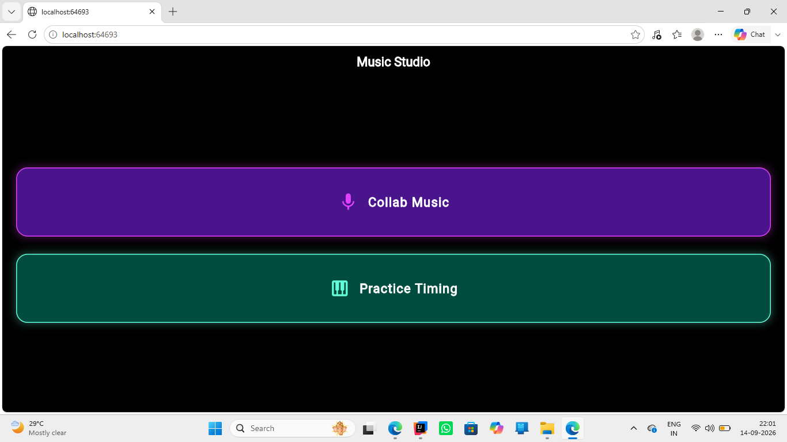
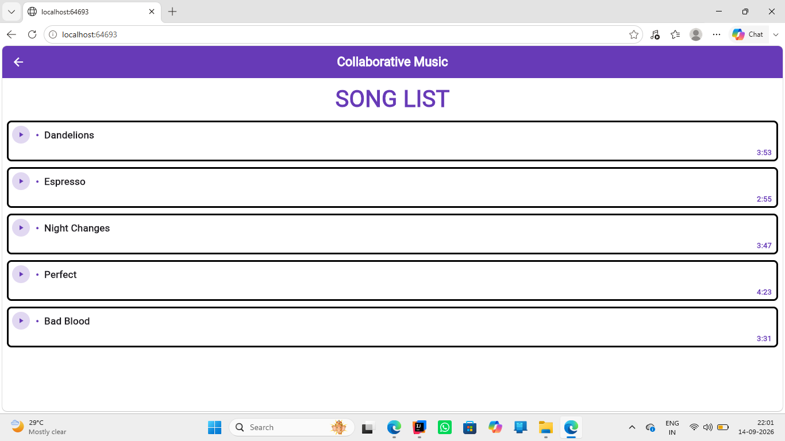
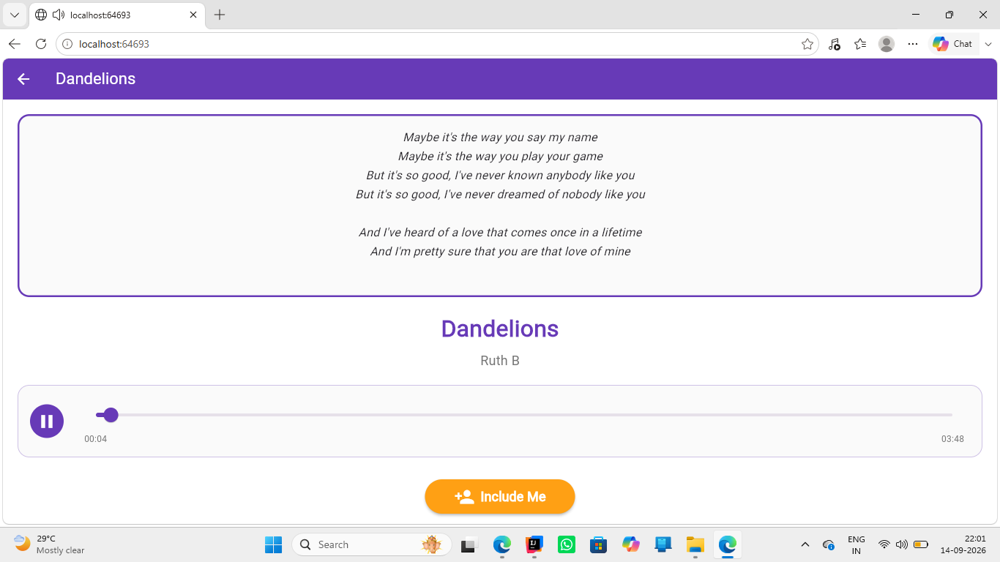
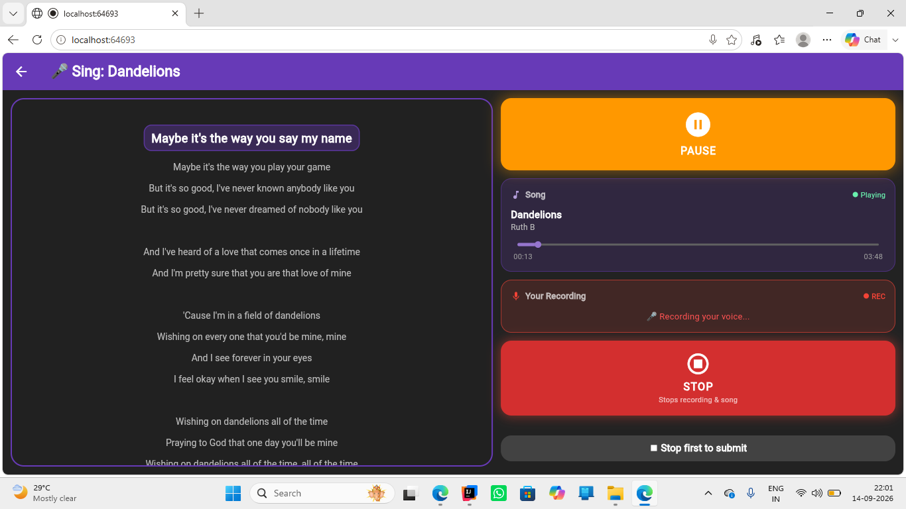
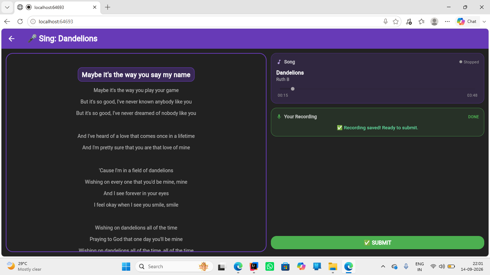
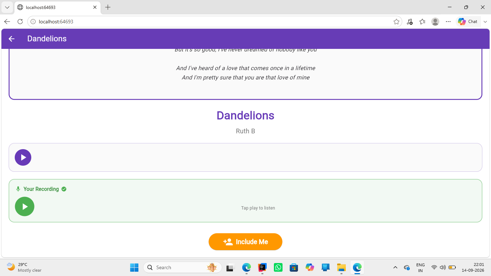
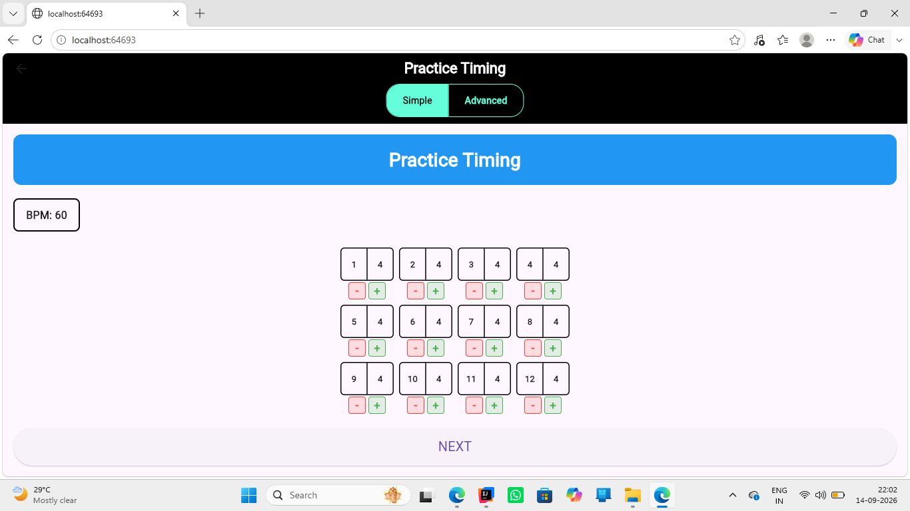
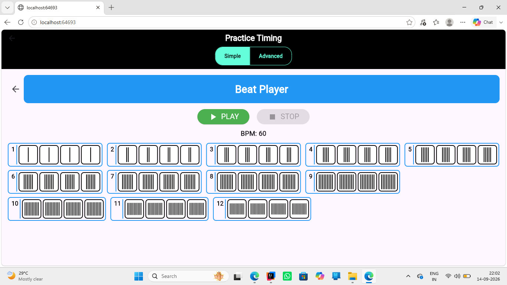
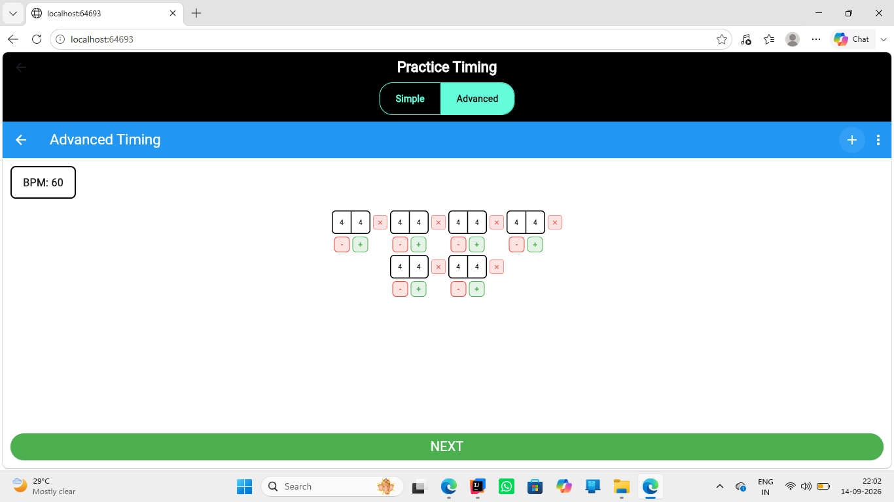
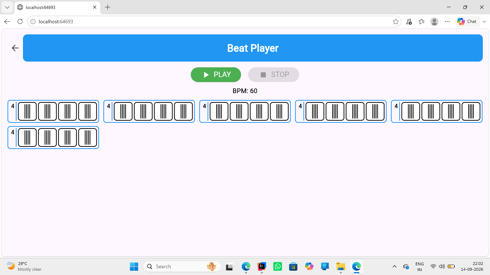

# 🎵 Collab Practice Advanced

A Flutter app for music playback, collaborative singing, and practice timing.

## ✨ Features
- 🎤 **Collaborative Singing** — Record and playback your voice
- ⏱️ **Practice Timer** — Simple countdown timer
- 🚀 **Advanced Timer** — Beat player with customizable BPM

## 📱 Screenshots

| Home | Song List | Song Player |
|:---:|:---:|:---:|
|  |  |  |

| Recording | Done | Playback |
|:---:|:---:|:---:|
|  |  |  |

| Practice | Beat Player |
|:---:|:---:|
|  |  |

| Advanced | Advanced Beat |
|:---:|:---:|
|  |  |

## 🛠️ Built With
- Flutter & Dart
- Android Studio
- Git & GitHub

## 🚀 Run Locally
```bash
git clone https://github.com/subzzio/collab-practice-advanced.git
cd collab-practice-advanced
flutter pub get
flutter run

## 👤 Author
**Subzzio** — [@subzzio](https://github.com/subzzio)

## 📄 License
This project is licensed under the [MIT License](LICENSE).
